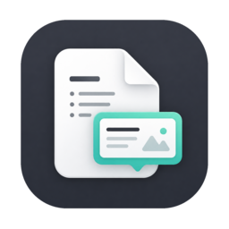

<h1>
  
  <span>Glance.md</span>
</h1>

> Preview selected Markdown from any app in a lightweight floating popover. <br />
> A minimalist local menu bar app. No internet required.


## 📦 Install

```sh
brew tap Liooo/tap
brew install --cask glance-md

# If macOS blocks the app as an unidentified developer, remove quarantine after install:
xattr -dr com.apple.quarantine /Applications/GlanceMD.app

```

## ✨ Motivation

- For a quick preview, it's been overkill to copy the text, switch to a preview app or browser, paste it, then switch back to the original app.
- Wanted one handy reliable place to preview Markdown from anywhere on the machine.
- Wanted to be freed from waiting for another app to support Markdown rendering.

## ⚡ Key Features

- keyword searching
- best-effort parsing for tables wrapped in narrow windows
- Mermaid.js rendering
- light/dark mode

## ⚠️ Limitation

Some apps do not expose the current text selection through the macOS Accessibility API. As a workaround, cmd+c copy then hit clipboard preview hotkey.
